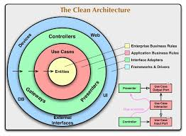

## CLEAN ARCHRITECTURE
#### Reference Resource: [github clean-architecture](https://github.com/amitshekhariitbhu/go-backend-clean-architecture/tree/main/mongo)


# Overall 

## Entities: 
    Domain and Repository in Entities
- Directories like domain and repository may contain components related to the core Entities in Clean Architecture. 
- In this case, domain might hold the core objects and business logic of the application, while repository could contain classes or components related to data access.

## UseCase
    Usecase or Interactions in Usecase
- The useCase directory may contain the use cases (or interactions) 
- in Clean Architecture, which are components that contain the business logic of the application.

## Interface Adapters
    API, Infrastructor and internal in Interface Adapter
- Directories such as api, infrastructor, and internal may contain components related to interfaces and infrastructure. 
- In Clean Architecture, these components are often called Interface Adapters, responsible for converting data between internal and external components of the application.
  #### api 
- may contain components related to handling HTTP requests from the client.
  
  #### infrastructor 
- may contain components related to implementing infrastructure such as databases, peripheral services, etc.
  
  #### internal 
- may contain internal application components that are not meant to be accessed from outside, such as authentication mechanisms (in this case OAuth2) or special connections to third-party services (e.g., connecting to Google services).


## Frameworks and Drivers
    Idea, asset and bootstrap
- Directories like .idea, assets, and bootstrap may contain components related to frameworks, tools, and resources such as images, fonts, CSS files, JavaScript files, etc. 
- These components are typically not part of Clean Architecture but are still important for implementing the application.

### File Structure
```
├───.idea
├───api
│   ├───controller
│   │   └───user
│   ├───middleware
│   └───router
│       └───user
├───assets
├───bootstrap
├───domain
│   ├───mock
│   │   └───user
│   ├───request
│   │   ├───admin
│   │   ├───course
│   │   ├───feedback
│   │   ├───lesson
│   │   ├───log
│   │   ├───position
│   │   ├───quiz
│   │   ├───role
│   │   ├───user
│   │   ├───user_attempt
│   │   ├───user_process
│   │   └───user_quiz_attempt
│   └───response
├───infrastructor
│   └───mongo
│       └───mocks
├───internal
│   └───Oauth2
│       └───google
├───repository
│   └───test
│       ├───admin
│       └───user
└───usecase
    ├───admin
    ├───system
    └───user
```
### Run Programming