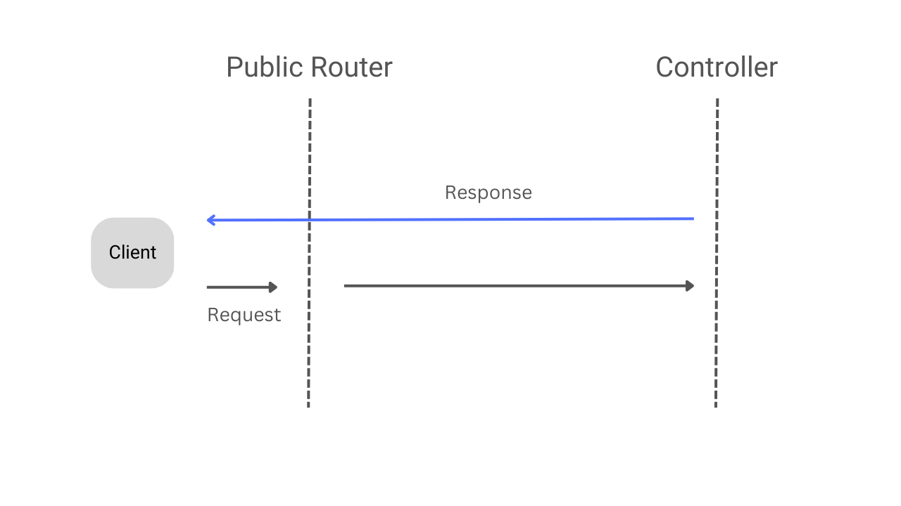

## CLEAN ARCHRITECTURE
#### Reference Resource: [github clean-architecture](https://github.com/amitshekhariitbhu/go-backend-clean-architecture/tree/main/mongo)

### API
### Assets
### Bootstrap
### CMD
### Router
First of all, the request comes to the Router.

Further, this router gets divided into two routers as follows:

Public Router: All the public APIs should go through this router.
Protected Router: All the private APIs should go through this router.
The Public API request flow:

The Private API request flow:

JWT Authentication Middleware for Access Token Validation.

In between both routers, a middleware gets added to check the validity of the access token. So, the private request with the invalid access token should not reach the protected router at all.

### Controller
- So now, the request is with the controller. First, it will validate the data present inside the request. If anything is invalid, it returns a "400 Bad Request" as the error response.
- If everything is valid inside the request, it will call the usecase layer to perform an operation.

### Usecase
- The usecase layer is dependent on the repository layer.
- This layer uses the repository layer to perform an operation. 
It is completely up to the repository how it is going to perform an operation.

### Repository
- The repository is the dependency of the usecase. The Usecase layer asks the repository to perform an operation.
- The repository layer is free to choose any database, in fact, it can call any other independent services based on the requirement.
- In the project, the repository layer makes the database query for performing operations asked by the Usecase layer.

### Domain

### File Structure
```
├───.idea
├───api
│   ├───controller
│   ├───middleware
│   └───route
├───assets
├───bootstrap
├───cmd
├───domain
│   ├───mock
│   ├───request
│   └───response
├───infrastructor
│   └───mongo
│       └───mocks
├───internal
├───repository
├───router
└───usecase
├───admin
├───system
└───user
```
### Run Programming